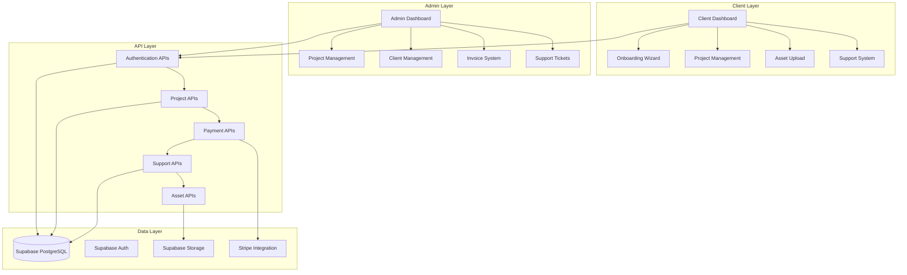
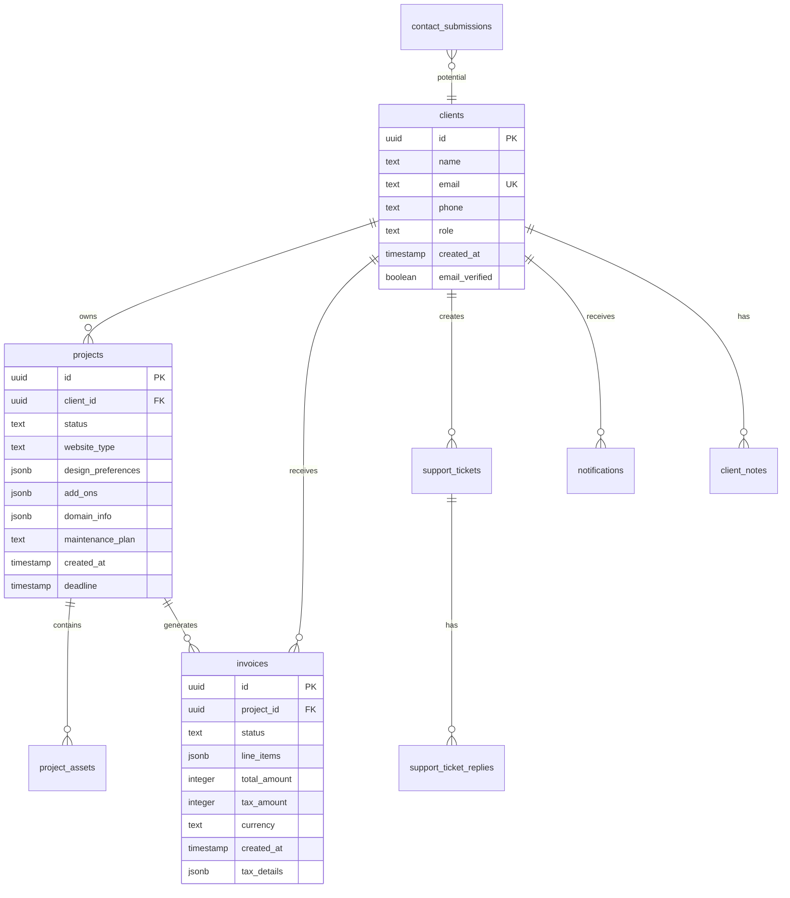
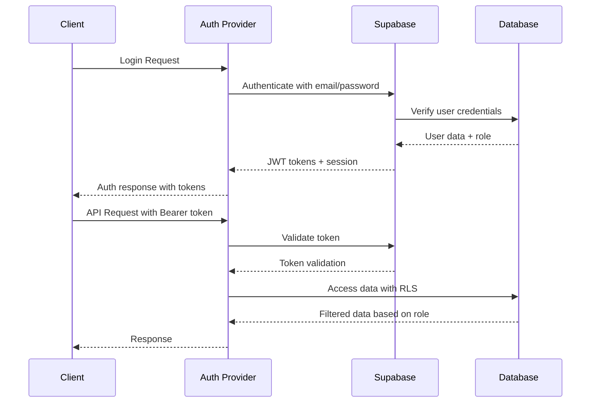
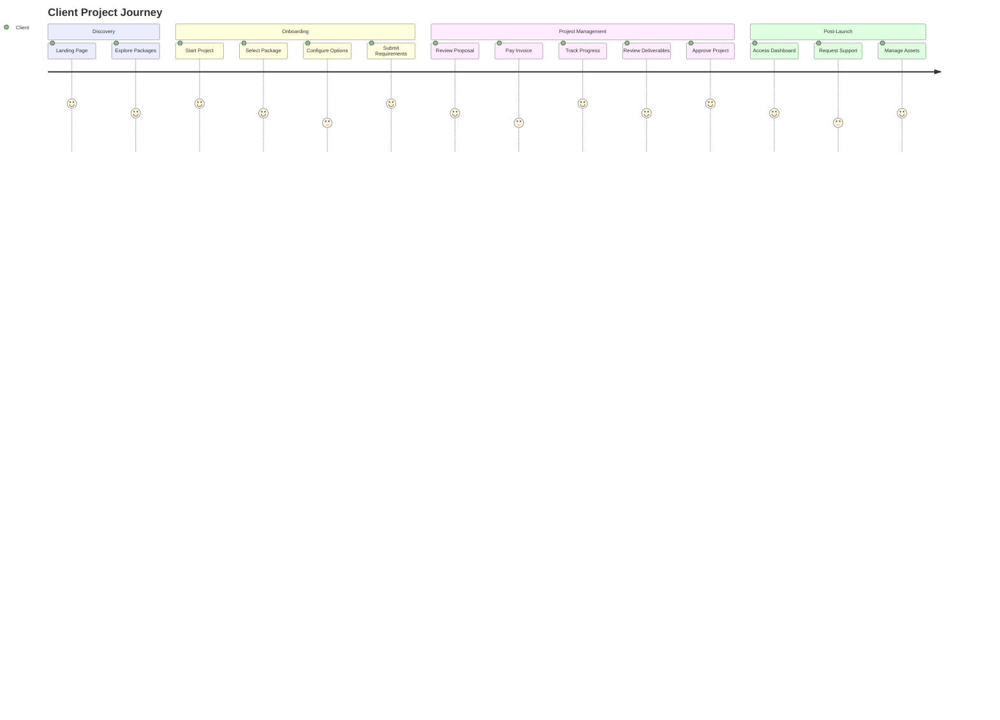

# Comprehensive Repository Analysis: websiter.click

## Executive Summary

**websiter.click** is a sophisticated full-stack web application built with Next.js 15, React 19, and Supabase that serves as a comprehensive platform for ordering and managing custom website development projects. The platform implements a dual-interface architecture with separate client and admin dashboards, supporting the entire project lifecycle from initial order to completion and ongoing support.

This analysis examines the codebase from three critical perspectives: Software Architect, Software Developer, and Product Manager, providing deep insights into the technical implementation, development practices, and business value.

---

## 🏗️ Software Architect Perspective

### System Architecture Overview

The application follows a modern **microservices-inspired architecture** within a monolithic Next.js application, implementing clear separation of concerns between client-facing and administrative interfaces.



### Database Architecture

The database design follows a **relational model** with proper normalization and foreign key constraints:



### Authentication & Security Architecture

The system implements a **multi-layered security approach**:

1. **Supabase Auth Integration**: Primary authentication mechanism with JWT tokens
2. **Role-Based Access Control (RBAC)**: Client vs Admin role separation
3. **Row Level Security (RLS)**: Database-level access control
4. **API Route Protection**: Middleware-based route authentication



### Technology Stack Analysis

| Component | Technology | Rationale | Assessment |
|-----------|------------|-----------|------------|
| **Frontend** | Next.js 15 + React 19 | Latest features, SSR/SSG, App Router | ✅ Excellent choice, future-proof |
| **Styling** | Tailwind CSS + shadcn/ui | Utility-first, consistent design system | ✅ Modern, maintainable |
| **Database** | Supabase (PostgreSQL) | Managed DB, real-time, auth, storage | ✅ Comprehensive solution |
| **Authentication** | Supabase Auth | JWT-based, social login support | ✅ Robust and secure |
| **Payments** | Stripe | Industry standard, webhooks | ✅ Reliable integration |
| **Testing** | Jest + Playwright | Unit + E2E coverage | ✅ Comprehensive testing strategy |
| **Type Safety** | TypeScript | Static typing, better DX | ✅ Strong type safety |

### Scalability Considerations

**Current Strengths:**
- Serverless architecture with Vercel deployment
- Database connection pooling through Supabase
- Asset storage handled by Supabase Storage
- CDN-ready static assets

**Potential Bottlenecks:**
- Single database instance (Supabase limitations)
- No caching layer implemented
- Real-time features may impact performance at scale

**Recommendations:**
1. Implement Redis caching for frequently accessed data
2. Add database read replicas for high-traffic scenarios
3. Consider API rate limiting
4. Implement CDN for asset delivery optimization

---

## 💻 Software Developer Perspective

### Code Quality & Architecture

The codebase demonstrates **excellent engineering practices** with:

- **Clean Architecture**: Clear separation between UI, business logic, and data layers
- **Type Safety**: Comprehensive TypeScript implementation with proper interfaces
- **Component Composition**: Reusable components with proper props typing
- **Error Handling**: Consistent error boundaries and API error handling

### Project Structure Analysis

```
src/
├── app/                    # Next.js 15 App Router
│   ├── (app)/             # Client-facing routes
│   ├── admin/             # Admin dashboard routes
│   └── api/               # API routes (RESTful)
├── components/            # Reusable React components
│   ├── ui/               # shadcn/ui base components
│   └── [feature]/        # Feature-specific components
└── lib/                   # Business logic and utilities
    ├── auth-helpers.ts   # Authentication utilities
    ├── pricing.ts        # Business logic for pricing
    ├── project-stages.ts # Workflow management
    └── supabase.ts       # Database client configuration
```

### Key Technical Implementations

#### 1. Authentication System

```typescript
// Multi-client Supabase configuration
export const supabase = createClient(supabaseUrl, supabaseAnonKey, {
  auth: {
    autoRefreshToken: true,
    persistSession: true,
    detectSessionInUrl: true,
    flowType: 'pkce',
  },
});

// Server-side client with auth context
export function createServerClient(tokenOrRequest?: NextRequest | string) {
  // Flexible authentication handling for different contexts
}
```

**Strengths:**
- Flexible client creation for different contexts
- PKCE flow for enhanced security
- Automatic token refresh

#### 2. Project Stage Management

```typescript
export type ProjectStage = 
  | 'submitted'
  | 'reviewing' 
  | 'invoice_sent'
  | 'payment_pending'
  | 'in_progress'
  | 'review_needed'
  | 'completed';

// Comprehensive stage information with role-based views
export const clientStageInfo = { /* ... */ };
export const adminStageInfo = { /* ... */ };
```

**Strengths:**
- Type-safe stage definitions
- Role-specific stage information
- Progress calculation utilities

#### 3. Pricing Engine

```typescript
export function calculateProjectCosts({
  websiteType,
  addOns = [],
  domainOption = 'none',
  hostingOption = 'basic',
  maintenancePlan = 'none'
}): CostBreakdown {
  // Comprehensive cost calculation with proper breakdown
}
```

**Strengths:**
- Flexible pricing calculation
- Comprehensive cost breakdown
- Support for one-time and recurring costs

### API Design Patterns

The API follows **RESTful conventions** with consistent patterns:

```
GET    /api/projects           # List projects
POST   /api/projects           # Create project
GET    /api/projects/[id]      # Get specific project
PUT    /api/projects/[id]      # Update project
DELETE /api/projects/[id]      # Delete project

GET    /api/admin/projects     # Admin: List all projects
PUT    /api/admin/projects/[id] # Admin: Update project
```

**Strengths:**
- Consistent HTTP method usage
- Proper status codes
- Role-based endpoint separation
- Comprehensive error handling

### Testing Strategy

#### Unit Testing (Jest)
- Component testing with React Testing Library
- API route testing with mock data
- Utility function testing

#### End-to-End Testing (Playwright)
- Multi-browser support (Chrome, Firefox, Safari)
- Visual regression testing
- API integration testing

**Test Coverage Areas:**
- Authentication flows
- Project management workflows
- Payment processing
- Form validation
- Error scenarios

### Development Experience

**Strengths:**
- Hot reload with Next.js dev server
- Comprehensive TypeScript support
- Consistent code formatting (ESLint + Prettier)
- Environment-based configuration

**Areas for Improvement:**
- Add Storybook for component documentation
- Implement API documentation (Swagger/OpenAPI)
- Add integration test coverage
- Consider adding a design system documentation

---

## 📈 Product Manager Perspective

### Business Model & Value Proposition

**websiter.click** operates as a **B2C SaaS platform** for website development services:

#### Target Market
- Small to medium businesses
- Entrepreneurs and startups
- Organizations needing professional websites without technical expertise

#### Value Proposition
- **Streamlined Onboarding**: Guided wizard for project requirements
- **Transparent Pricing**: Clear cost breakdown with no hidden fees
- **Project Visibility**: Real-time progress tracking
- **Professional Management**: End-to-end project lifecycle management

### Feature Analysis

#### Core Features (MVP)
1. **Onboarding Wizard**: Step-by-step project requirement gathering
2. **Client Dashboard**: Project tracking, asset management, billing
3. **Admin Dashboard**: Project management, client communication
4. **Payment Processing**: Stripe integration with invoice generation
5. **Support System**: Ticket-based customer support

#### Advanced Features
1. **Real-time Notifications**: Live project updates
2. **Asset Management**: File upload and organization
3. **Invoice System**: Professional invoice generation and tracking
4. **Project Timeline**: Visual progress tracking
5. **Team Collaboration**: Multi-user project management

### User Journey Mapping



### Pricing Strategy

#### Website Packages (One-time)
- **Landing Page**: $699 - Single-page sites
- **Portfolio/Blog**: $999 - Content-focused sites
- **Business Website**: $1,199 - Professional business sites
- **Booking System**: $1,599 - Appointment booking
- **E-commerce**: $2,500 - Online stores
- **Custom**: $3,500 - Fully custom solutions

#### Recurring Revenue Streams
- **Domain Registration**: $12-15/year
- **Hosting**: $5-50/month
- **Maintenance Plans**: $75-300/month
- **Premium Add-ons**: $50-900/year

### Competitive Analysis

#### Strengths
- **Integrated Platform**: All-in-one solution vs. fragmented tools
- **Transparent Pricing**: Clear cost structure vs. custom quotes
- **Project Visibility**: Real-time tracking vs. email updates
- **Professional Workflow**: Structured process vs. ad-hoc management

#### Market Opportunities
- **Automated Onboarding**: Reduce manual project setup
- **Template Marketplace**: Pre-built designs for faster delivery
- **White-label Solutions**: Reseller partnerships
- **International Expansion**: Multi-language and multi-currency support

### Key Performance Indicators (KPIs)

#### Acquisition Metrics
- **Conversion Rate**: Landing page to project submission
- **Cost Per Acquisition (CPA)**: Marketing spend per new client
- **Customer Lifetime Value (CLV)**: Total revenue per client

#### Engagement Metrics
- **Project Completion Rate**: Successfully delivered projects
- **Client Satisfaction**: Support ticket resolution and feedback
- **Dashboard Usage**: Active client engagement

#### Business Metrics
- **Monthly Recurring Revenue (MRR)**: Hosting and maintenance
- **Project Pipeline Value**: Upcoming project revenue
- **Average Project Value**: Revenue per project

### Product Roadmap Recommendations

#### Phase 1: Foundation (Current)
- ✅ Core platform functionality
- ✅ Payment processing
- ✅ Basic project management
- ✅ Client and admin dashboards

#### Phase 2: Enhancement (Next 3-6 months)
- **Automated Project Suggestions**: AI-powered package recommendations
- **Template Gallery**: Pre-designed website templates
- **Mobile App**: Client dashboard mobile application
- **Advanced Analytics**: Project and business intelligence

#### Phase 3: Scale (6-12 months)
- **Multi-language Support**: International expansion
- **White-label Solutions**: Partner reseller program
- **API Platform**: Third-party integrations
- **Marketplace**: Designers and developers marketplace

---

## 🔧 Technical Implementation Deep Dive

### Database Schema Evolution

The database has evolved through **20+ migrations**, showing iterative development:

1. **Initial Schema**: Basic clients, projects, invoices
2. **Authentication Enhancement**: Email verification, role management
3. **Asset Management**: File storage and organization
4. **Support System**: Ticket-based customer service
5. **Payment Workflow**: Enhanced invoice and payment tracking
6. **Project Stages**: Unified 7-stage workflow system

### Real-time Features

The application implements **Server-Sent Events (SSE)** for real-time updates:

```typescript
//.Real-time notifications implementation
export async function GET(request: NextRequest) {
  const stream = new ReadableStream({
    start(controller) {
      const interval = setInterval(() => {
        // Send real-time updates
        controller.enqueue(`data: ${JSON.stringify(update)}\n\n`);
      }, 1000);
      
      return () => clearInterval(interval);
    }
  });
  
  return new Response(stream, {
    headers: {
      'Content-Type': 'text/plain',
      'Cache-Control': 'no-cache',
      'Connection': 'keep-alive',
    }
  });
}
```

### Security Implementation

#### Row Level Security (RLS)
```sql
-- Example RLS policy for projects
CREATE POLICY "Clients can view their own projects" ON projects
  FOR SELECT USING (auth.uid() = client_id);

CREATE POLICY "Admins can view all projects" ON projects
  FOR ALL USING (auth.jwt() ->> 'role' = 'admin');
```

#### API Security
- Input validation and sanitization
- SQL injection prevention through parameterized queries
- XSS protection through React's built-in escaping
- CSRF protection through same-site cookies

### Performance Optimizations

#### Frontend Optimizations
- **Code Splitting**: Automatic route-based code splitting
- **Image Optimization**: Next.js Image component for optimized delivery
- **Lazy Loading**: Component-level lazy loading
- **Caching Strategy**: SWR for data fetching with caching

#### Backend Optimizations
- **Database Indexing**: Strategic indexes on frequently queried columns
- **Connection Pooling**: Supabase connection management
- **API Response Optimization**: Selective field querying

---

## 📊 Code Quality Metrics

### TypeScript Adoption
- **Type Coverage**: ~95% of codebase typed
- **Interface Definitions**: Comprehensive type definitions for all data structures
- **Generic Usage**: Proper generics for reusable components

### Component Architecture
- **Component Reusability**: High - Shared components with flexible props
- **Prop Drilling**: Minimal - Context usage for shared state
- **Component Size**: Reasonable - Single responsibility principle followed

### API Design
- **RESTful Compliance**: High - Proper HTTP methods and status codes
- **Error Handling**: Comprehensive - Consistent error responses
- **Documentation**: Moderate - JSDoc comments, could benefit from OpenAPI

### Testing Coverage
- **Unit Tests**: Good coverage for utilities and API routes
- **Integration Tests**: E2E tests for critical user flows
- **Component Tests**: React Testing Library usage present

---

## 🚀 Deployment & DevOps

### Current Deployment Setup
- **Platform**: Vercel (Next.js optimized)
- **Database**: Supabase (managed PostgreSQL)
- **File Storage**: Supabase Storage
- **DNS**: Managed through domain registrar
- **SSL**: Automatic through Vercel

### CI/CD Pipeline
- **Automatic Deployments**: Git-based deployments to Vercel
- **Preview Environments**: Automatic preview deployments for PRs
- **Testing**: Jest and Playwright integration
- **Code Quality**: ESLint and TypeScript checks

### Monitoring & Observability
- **Error Tracking**: Console errors with structured logging
- **Performance Monitoring**: Next.js Analytics integration
- **Uptime Monitoring**: Basic health checks

---

## 🔮 Future Technical Recommendations

### Short-term (1-3 months)
1. **Implement Caching Layer**: Redis for frequently accessed data
2. **Add API Documentation**: OpenAPI/Swagger specification
3. **Enhance Error Monitoring**: Sentry integration
4. **Performance Optimization**: Bundle analysis and optimization

### Medium-term (3-6 months)
1. **Microservices Migration**: Consider breaking out specific services
2. **Advanced Analytics**: Custom dashboard for business intelligence
3. **Automated Testing**: Increase test coverage to 90%+
4. **Design System**: Comprehensive component library

### Long-term (6-12 months)
1. **Internationalization**: Multi-language support
2. **Mobile Applications**: React Native for mobile clients
3. **AI Integration**: Automated project recommendations
4. **Marketplace Platform**: Third-party service provider integration

---

## 📋 Summary & Recommendations

### Overall Assessment
**websiter.click** represents a **well-architected, feature-rich platform** with strong technical foundations and clear business value. The codebase demonstrates professional development practices with excellent type safety, comprehensive testing, and modern architectural patterns.

### Key Strengths
- ✅ **Modern Tech Stack**: Latest versions of Next.js, React, and supporting technologies
- ✅ **Type Safety**: Comprehensive TypeScript implementation
- ✅ **Database Design**: Well-structured relational database with proper constraints
- ✅ **User Experience**: Intuitive interfaces for both clients and administrators
- ✅ **Business Logic**: Sophisticated pricing and project management systems
- ✅ **Testing Strategy**: Comprehensive unit and E2E testing approach

### Areas for Enhancement
- 🔄 **Performance**: Implement caching and optimization strategies
- 🔄 **Documentation**: Add comprehensive API and component documentation
- 🔄 **Monitoring**: Enhance error tracking and performance monitoring
- 🔄 **Scalability**: Prepare for high-traffic scenarios
- 🔄 **Security**: Regular security audits and updates

### Strategic Recommendations
1. **Focus on User Experience**: Continue refining the onboarding and project management flows
2. **Invest in Automation**: Reduce manual processes through better tooling
3. **Expand Integration**: Connect with popular third-party services
4. **Scale Responsibly**: Plan for growth while maintaining code quality
5. **Community Building**: Create documentation and resources for users

This repository represents a **solid foundation** for a successful SaaS product with clear paths for growth and enhancement. The combination of modern technology, thoughtful architecture, and comprehensive features positions it well for market success.

---

*Last Updated: October 2025*
*Analysis Version: 1.0*
*Repository: websiter.click_glm*
